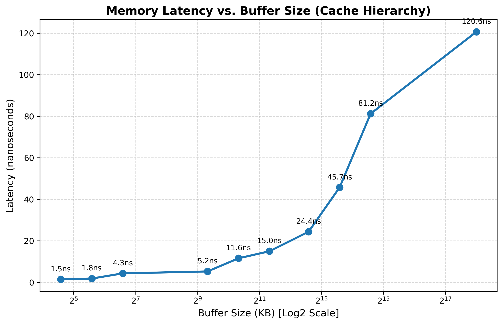

# MemDigger

MemDigger is a minimal, cross-platform memory benchmarking utility that measures true idle memory latency and sequential read bandwidth.
It dynamically detects the host CPU's cache topology (L1, L2, L3 boundaries) to generate precise test sizes,
ensuring accurate latency step-function measurements without relying on hardcoded buffer sizes.

I used the custom build system I made for my C++ projects, check out [Redline](https://github.com/abhyuday-fr/Redline)

## Features

- Topology-Aware: Queries sysfs (Linux) or GetLogicalProcessorInformation (Windows) to identify exact L1, L2, and L3 cache boundaries.

- Hardware Prefetcher Defeat: Uses pointer-chasing (randomized linked-list traversal) to measure genuine memory access latency.

- Cross-Platform: C++17 codebase for Linux and Windows by using macros.

- CSV Output: Exports raw metrics directly to memory_results.csv for downstream analysis.

## Prerequisites
- Compiler: A C++17 compatible compiler (e.g., GCC 15+).
- Build System (Optional): CMake 3.10 or higher.
- Python: Python 3 with pandas and matplotlib installed for visualization.

## Example

This is the plot for memory read latency on (close to) idle machine



## Build & Run Instructions

### Option 1: CMake

**Linux/MacOS**:

```sh
mkdir build
cd build
cmake -DCMAKE_BUILD_TYPE=Release ..
make
cd ..
./build/MemDigger
```

**Windows**:

```sh
mkdir build
cd build
cmake ..
cmake --build . --config Release
cd ..
.\build\Release\MemDigger.exe
```

### Option 2: Direct Compiler

**Linux (GCC/Clang)**:

```sh
g++ -std=c++17 -O3 -march=native src/main.cpp src/mem_bench.cpp -o MemDigger -lpthread
./MemDigger
```

**Windows (MSVC)**:

Open the "x64 Native Tools Command Prompt for VS" and run:

```sh
cl /std:c++17 /O2 /EHsc src\main.cpp src\mem_bench.cpp /Fe:MemDigger.exe
MemDigger.exe
```

## Output & Visualization

Running the executable will automatically create a `data/` directory and save the benchmark results to `data/memory_results.csv`.

To generate a log-scaled line chart illustrating your processor's latency step-function:

1. Ensure the Python dependencies are installed:

```sh
pip install pandas matplotlib
```

2. Run the visualization script from the project root:

```sh
python plot_results.py
```

3. The script will read from the `data/` directory and output a high-resolution `data/memory_latency_curve.png` file plotting the exact cache hierarchy boundaries.

### Linux

```sh
./MemDigger
```

## How did I use Redline to build and run this

1. Installed redline with this command

```sh
curl -sSL https://raw.githubusercontent.com/abhyuday-fr/Redline/main/install.sh | sh
```

2. Ran `redline rev MemDigger`

3. Changed the edition to cpp17 in redline.toml

4. Added the header, implementation and main file in src/ folder

5. In CMakeLists.txt, added:

```CMakeLists.txt
target_sources(MemDigger PRIVATE src/mem_bench.cpp)

find_package(Threads REQUIRED)
target_link_libraries(MemDigger PRIVATE Threads::Threads)
```

6. Built and ran with:

```sh
redline run --release
```
